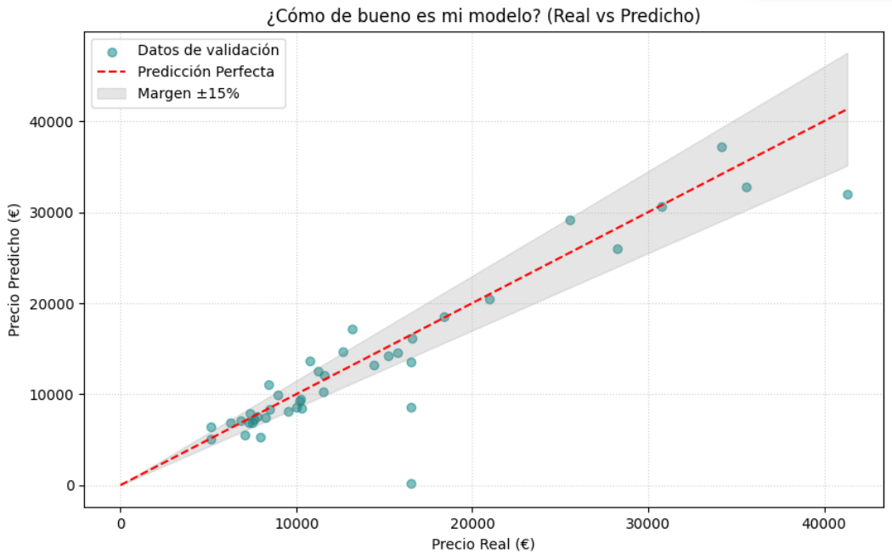

# 🚗 Predicción de Precios de Automóviles con PyTorch


Este repositorio contiene una implementación completa de una red neuronal de regresión diseñada para estimar el **precio de mercado de vehículos**. El proyecto abarca desde la limpieza de datos crudos hasta la implementación de técnicas de regularización para obtener un **modelo robusto y preciso**.

## 📊 Resumen del Proyecto
El objetivo principal es transformar características técnicas de los vehículos (caballos, tamaño del motor, marca, etc.) en una predicción económica precisa. Se ha puesto especial énfasis en evitar el **sobreajuste (overfitting)** para que el modelo sea capaz de generalizar correctamente ante coches que no ha visto durante el entrenamiento.

## 📁 Estructura del Proyecto

```text
AUTOMOBILE-IA-REGRESSION-PYTORCH/
├── data/                           # Datasets originales (ficheros .csv / .data)
├── img/                            # Recursos visuales
│   └── real_prediccion_auto.png    # Gráfica de resultados (Real vs Predicho)
├── notebooks/                      # Espacio de trabajo y experimentación
│   ├── modelos/                    # Pesos guardados del modelo (.pth)
│   ├── runs/                       # Logs de entrenamiento para TensorBoard
│   ├── scaler/                     # Archivos del StandardScaler guardado
│   └── red_neuronal_automobile.ipynb # Notebook principal con el desarrollo
├── LICENSE                         # Licencia MIT
├── pyproject.toml                  # Configuración de dependencias del proyecto
├── README.md                       # Documentación del proyecto
```

## 🛠️ Stack Tecnológico
- **Entorno de Desarrollo:** `Visual Studio Code` (Notebooks `.ipynb`)
- **Framework:** `PyTorch`
- **Procesamiento de Datos:** `Pandas`, `NumPy`, `Scikit-Learn`
- **Monitorización:** `TensorBoard`
- **Visualización:** `Matplotlib`

## 🧠 Arquitectura de la Red Neuronal
El modelo se basa en un Perceptrón Multicapa (MLP) con la siguiente estructura:
- **Capa de Entrada:** 67 neuronas (tras aplicar One-Hot Encoding a las variables categóricas).
- **Capa Oculta 1:** 64 neuronas con activación **ReLU**.
- **Regularización:** Capa de **Dropout (10%)** para mejorar la robustez y evitar la memorización de datos.
- **Capa Oculta 2:** 64 neuronas con activación **ReLU**.
- **Capa de Salida:** 1 neurona (valor escalar del precio).

## ⚙️ Configuración del Entrenamiento
Para lograr los resultados actuales, se utilizaron los siguientes hiperparámetros:
- **Optimizador:** `Adam` con un Learning Rate de `0.0005`.
- **Función de Pérdida:** `MSELoss` (Error Cuadrático Medio).
- **Épocas:** 300 (punto óptimo de convergencia detectado en TensorBoard).
- **División de Datos:** 80% entrenamiento y 20% validación mediante `random_split`.

## 📈 Evaluación y Resultados
El rendimiento del modelo se valida comparando la pérdida de entrenamiento frente a la de validación. 
- **Consistencia:** Gracias al Dropout, la brecha entre ambas curvas es mínima, lo que indica un entrenamiento equilibrado.
- **Precisión:** Tras activar el modo de evaluación, el modelo sitúa la gran mayoría de sus predicciones dentro de un **margen de error del 15%** respecto al precio real del vehículo.

<br>

<p align="center">
  
</p>


## 💻 Notas de Implementación (Tips Técnicos)
### Compatibilidad en Windows
Debido a la gestión de subprocesos en Windows (`spawn`), los `DataLoaders` han sido configurados con `num_workers=0`. Esto evita bloqueos y errores de memoria al trabajar en entornos de Jupyter Notebooks.

### Protocolo de Inferencia
Es fundamental seguir estos pasos para realizar predicciones correctas:
1.  **Modo Evaluación:** Invocar `model.eval()` para desactivar las capas de Dropout.
2.  **Sin Gradientes:** Usar el contexto `torch.no_grad()` para optimizar la memoria y velocidad.
3.  **Escalado:** Los datos de entrada deben ser transformados con el `StandardScaler` original antes de pasar por la red.

---

## 💻 Acceso Rápido al Código

Puedes explorar el código completo, las explicaciones paso a paso y las gráficas generadas directamente en el cuaderno principal del proyecto haciendo clic en el siguiente enlace:

👉 **[Abrir el Jupyter Notebook: `red_neuronal_automobile.ipynb`](/notebooks/red_neuronal_automobile.ipynb)**

> 💡 **Nota:** GitHub renderiza los archivos `.ipynb` de forma nativa, por lo que puedes visualizar todo el código, los comentarios y los resultados de las ejecuciones directamente desde tu navegador sin necesidad de descargar nada.

[](https://colab.research.google.com/github/Alexisfpy/Automobile-Ia-Regression-Pytorch/blob/master/notebooks/red_neuronal_automobile.ipynb)

## ⚙️ Instalación y Uso

Sigue estos pasos para clonar el proyecto y ejecutar el modelo en tu máquina local:

### 1. Requisitos previos (`venv`)

El módulo `venv` viene instalado por defecto al instalar Python en Windows y macOS. Sin embargo, si usas una distribución de Linux basada en Debian/Ubuntu y te da error al intentar crearlo, instálalo manualmente con este comando:

```bash
sudo apt update
sudo apt install python3-venv
```
### 2. Clonar el repositorio

Abre tu terminal y descarga el código:

```bash
git clone https://github.com/Alexisfpy/automobile-ia-regression-pytorch.git

cd automobile-ia-regression-pytorch

```
### 3. Crear y activar el entorno virtual
```bash
python -m venv .venv
```
#### En Windows
```bash
.venv\Scripts\activate
```
#### En Linux/macOs
```bash
source .venv/bin/activate
```
### 4. Instalar dependencias
Este proyecto utiliza un archivo pyproject.toml para gestionar sus paquetes. Con el entorno virtual activado, instala todas las dependencias automáticamente ejecutando:
```bash
pip install .
```
o
```bash
uv sync
```
### 4. Lanzar el cuaderno interactivo
Una vez instalado todo, arranca el entorno de Jupyter para ver el código fuente y ejecutar la red neuronal:
```bash
jupyter notebook red_neuronal_automobile.ipynb
```

## 📄 Licencia

Este proyecto está bajo la Licencia MIT - mira el archivo [LICENSE](LICENSE) para más detalles.


*Desarrollado para el módulo de IA - Regresión con Redes Neuronales.*